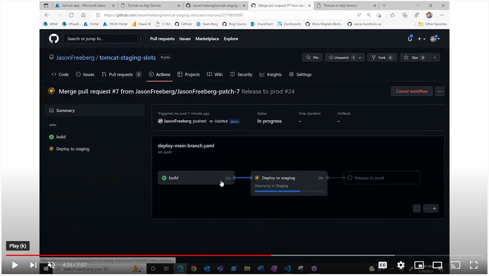
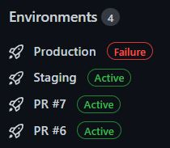

# GitHub Actions & App Service Deployment Slots

This repo contains a sample Tomcat application and GitHub Actions workflow files to deploy the application to test environments for each pull request. Additionally, when a PR is merged into the main branch, the main branch is deployed to a staging environment where a code-owner will be prompted to approve the release to production. While this repo uses Java 11 and Tomcat 9, this pattern works for any of the other runtimes offered by App Service: .NET, Python, Node.js, PHP, and docker containers. You can adapt the workflow files by replacing the `install-java` and `mvn` commands with your desired runtime and build tool (such as `install-node` and `npm`).

## Demo Video

The following is a video which demonstrates how the workflows work together for a Pull Request review, merge into main, and release to production. Click the image to open the link to YouTube.

## Workflow files

- [`deploy-pull-request.yaml`](.github/workflows/deploy-pull-request.yaml): Triggered when a Pull Request is opened against the main branch. Two jobs run concurrently: one to build and test the application, and a second to create the test environment. Once both those jobs complete, the third job deploys the application to the test environment and comments on the PR with a URL to the environment. From there, a reviewer can browse to the URL to validate the changes.
  
    This workflow also creates an "[Environment](https://docs.github.com/en/actions/deployment/targeting-different-environments/using-environments-for-deployment)" on GitHub:

    

- [`delete-pr-env.yaml`](.github/workflows/delete-pr-env.yaml): When a PR against the main branch is closed, this workflow deletes the test environment on App Service, and deletes the the "deployment environment" on GitHub so it does not show on the repository side panel.
  - **Note:** This and the previous workflow use the [`concurrency`](https://docs.github.com/en/actions/using-jobs/using-concurrency) feature. This means that for the same PR, the `delete-pr-env.yaml` and `deploy-pull-request.yaml` workflows cannot run simultaneously. This prevents a race condition where a commit is made on the PR shortly before being merged. In which case, `delete-pr-env.yaml` may complete before `deploy-pull-request.yaml` completes, which would result in a "dangling" test environment that would need to be manually cleaned up.
- [`deploy-main-branch.yaml`](.github/workflows/deploy-main-branch.yaml): When a push is made to the main branch, the application is built and tested (similar to the first workflow) and deployed to the **staging** environment. At that point, the workflow pauses and waits for a Code Owner to review and approve the build to deploy to production. Once approved, the final job will swap the staging and production environments.

## Set up the demo

1. Create an Azure Web App
2. Create a slot called "staging" on the Azure Web App
3. Create a Service Principal that has Contributor rights on the Web App. [More Info](https://github.com/azure/webapps-deploy#configure-deployment-credentials-1)
4. Create a GitHub Actions secret called `AZURE_CREDENTIALS` with the SP
   1. **Note**: As of June 2022, there was a breaking change introduced in later versions of the Azure CLI command which generates the SP. Until the `webapps-deploy` action is updated, [you must reformat the SP JSON](https://github.com/Azure/webapps-deploy/issues/220#issuecomment-1054550932).
5. Replace the placeholders in the `env:` section with your webapp name and resource group name.
